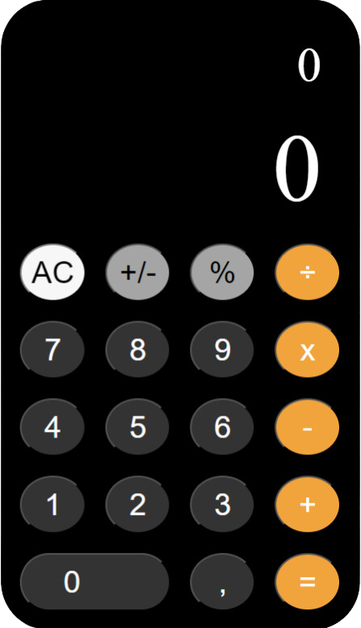

# Calculator



Calculator application created in ReactJS and based on the Iphone calculator.

## Steps to follow if you want to use this project in your computer

This project has been developed with a React Starter Kit, where a series of pre-installed and pre-configured tools and dependencies are available to optimize and organize the project.

To be able to work with it, you will have to follow the next steps:

1. Create your repository.
2. Copy all project files in the root file of your repository.
3. Open the shell command and install all necessary dependencies listed here below:

```bash
npm install
npm install node-sass
npm install react-router-dom
```

4. Once all dependencies have been installed, you will be able to run the project typing in the shell command:

```bash
npm start
```

5. This command:

- Opens a new window in Google Chrome and shows the web application, just as the VS Code Live Server (Go Live) plugin does.
- While opened, it observes all the files within the src/ file, so when any of them have been changed it will refresh your page in Google Chrome.
- It also processess the files HTML, Sass / Css and JSX so that the browser is able to read them. For instance:
  It converts Sass into Css.
  It converts JSX into HTML and Javascript.

6. Once you have executed npm start, you can start to work with all files within src/ and code comfortably.
